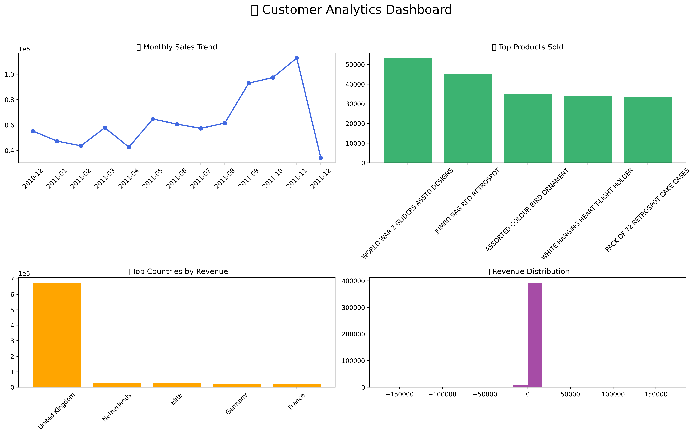

# Customer-Segmentation-Retention-Analysis
This project performs Customer Segmentation and Retention Analysis using transactional retail data. The goal is to understand customer behavior, identify high-value customers, and detect at-risk customers using RFM analysis and K-Means clustering.

## Objectives
- Perform data cleaning and preprocessing
- Analyze sales and customer behavior
- Build RFM (Recency, Frequency, Monetary) model
- Segment customers using K-Means clustering
- Identify VIP, loyal, and at-risk customers
- Generate business insights for retention strategy

## Technologies Used
- Python 
- Pandas
- NumPy
- Matplotlib
- Seaborn
- Scikit-learn
- Jupyter Notebook

## Dataset
Online Retail Dataset (UCI Repository)

## Workflow
Data Cleaning
Exploratory Data Analysis (EDA)
Feature Engineering (RFM)
Customer Segmentation using K-Means
Cluster Analysis
Business Insights

## Customer Segments
| Cluster ID | Customer Segment       | Description                                   |
|------------|------------------------|-----------------------------------------------|
| 0          | Loyal Customers        | Frequent and active buyers                    |
| 1          | At-Risk Customers      | Inactive customers likely to churn            |
| 2          | Champions (VIP)        | Highest frequency and spending customers       |
| 3          | Ultra High Value       | Top-tier premium customers                    |

## Key Insights
A small group of customers contributes majority of revenue
- VIP customers are highly active and valuable
- Significant churn risk exists in Cluster 1
- Strong opportunity for retention marketing

## Sample Visualizations
- Country-wise revenue analysis
- Monthly sales trends
- Customer segmentation scatter plots

## How to Run the Project
pip install pandas numpy matplotlib seaborn scikit-learn openpyxl    

Then open:
- customer_segmentation.ipynb
- Run all cells sequentially.

## Dashboard 

